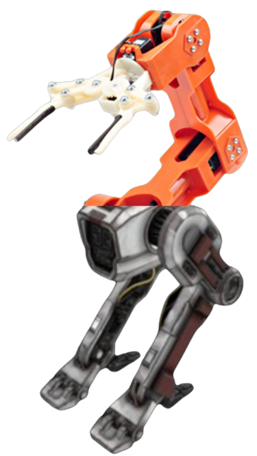

# B.R.A.R. - Bipedal Robotic Arm Runner

BRAR is an OpenGL-based game that simulates a bipedal 5-DOF robotic arm that tries to capure objects in the scene. 

--- 

<!--p align="center" width="100%">

</p-->

The arm depicted in this simulation attempts to model that of the Tinkerbot Braccio toy (orange arm shown below) to some degree. The body and legs will be modeled after StarWars' BD-1 robot shown on the right.

While the model of the robot is still in development, the image below is similar to what I am going for. I've added this image to the splashscreen of the game, which I may change, but its pretty stupid looking and I like that.

Depending on how the project developes, maybe a sim-to-real transfer could be attempted. This would likely require much tuning of the controller to meet real-world constraints, but it would be fun.

--- 

## Timeline 
### Oct 29 - Nov 4
- [x] Add ground scene and joint limit.
- [ ] Use spheres as initial objects (for testing).

### Nov 5 - Nov 11
- [x] Design baby robot legs onto robot. These will follow some simple back-and-fourth pattern when the robot moves.
- [x] Test initial tracking algorithms for the robot to chase the ball. Ball will be steered by heading.

### Nov 12 - Nov 18
- [] Expand ground plane and map texture onto ground. 
- [] Add gravity to robot and use the texture plane to be where robot lands. This can be seen as a weak form of ground-based collision detection.
-[] Inverse kinematics algorithm to position end-effector around object. Will verify through user-controlled item that the robot attempts to grab.

### Nov 19 - Nov 25
- [] Redesign object to be of a robot.
- [] Turn lighting into drone-looking systems. 
- [] Add self-collision detection.

### Nov 26 - Dec 02
*Project Review due Nov. 29th (Wednesday)*

### Dec 03 - Dec 09

### Dec 10 - Dec 12
-> Final Project due Dec. 12th (Tuesday)

--- 
## Game Modes:

1) User plays as robot arm and collects items to prevent a countdown timer from reaching zero.

2) User plays as item to run from robot arm as the arm gains speed and accuracy over time.

--- 

### Key bindings:

$$Lighting $$

    - 0: Turn off or on lighting (Default is off)
    - t: Move light upwards
    - f: Move light to the left
    - g: Move light to the right
    - v: Move light to the downwards

$$ Texture $$

    - 4: Turn textures on/off
    - 5: Switch texture to have different Bitmap as texture

$$ Views Modes $$

    - 1: Orthographic view (Default)
    - 2: Perspective view
    - 3: First-person view (Use keys to move about scene)

$$ Joint 0 $$

    - A: Move base clockwise about Z
    - D: Move base joint counterclockwise about Z

$$ Joint 1 $$

    - W: Tilt joint1 up
    - K: Tilt joint1 down

$$ Joint 2 $$

    - Y: Tilt joint2 up
    - H: Tilt joint2 down

$$ End Effector $$

    - UP: tilt gripper UP
    - DOWN: tilt gripper DOWN
    - LEFT: rotate gripper Counterclockwise
    - RIGHT: rotate gripper Clockwise
    - J: close gripper
    - K: open gripper

--- 
